# Data Flow

Purpose: define how data moves through Forakilo.
Scope: market data, features, models, signals, risk decisions, orders, fills, and audit records.
Audience: data engineers, ML engineers, backend engineers, and reviewers.
Assumptions: raw provider payloads are retained subject to provider terms and retention policy.
Dependencies: [Data Architecture](../data/DATA_ARCHITECTURE.md), [Order Execution](../trading/ORDER_EXECUTION_AND_RECONCILIATION.md).
Unresolved decisions: exact schemas and storage partitioning.

```mermaid
flowchart LR
    Provider[Provider APIs] --> Raw[Raw Immutable Zone]
    Raw --> Validate[Validation and Quarantine]
    Validate --> Normalized[Normalized Zone]
    Normalized --> Features[Feature Ready Zone]
    Features --> Train[Training Datasets]
    Features --> Inference[Live/Paper Inference Inputs]
    Train --> Model[Model Registry]
    Model --> Signal[Signal Service]
    Inference --> Signal
    Signal --> Risk[Risk Engine]
    Risk --> Paper[Paper Execution]
    Risk --> LiveGate[Live Trading Gate]
    Paper --> Recon[Reconciliation]
    LiveGate --> ProviderOrder[Provider Order API]
    ProviderOrder --> Recon
    Recon --> Audit[Audit and Observability]
```

## Data Rules

- Raw data MUST be immutable after capture.
- Every derived dataset MUST reference source data, contract version, code version, and processing time.
- Signals MUST reference model version, feature version, dataset version, and risk-policy version.
- Orders MUST reference signal, user, strategy, risk decision, and provider response.
