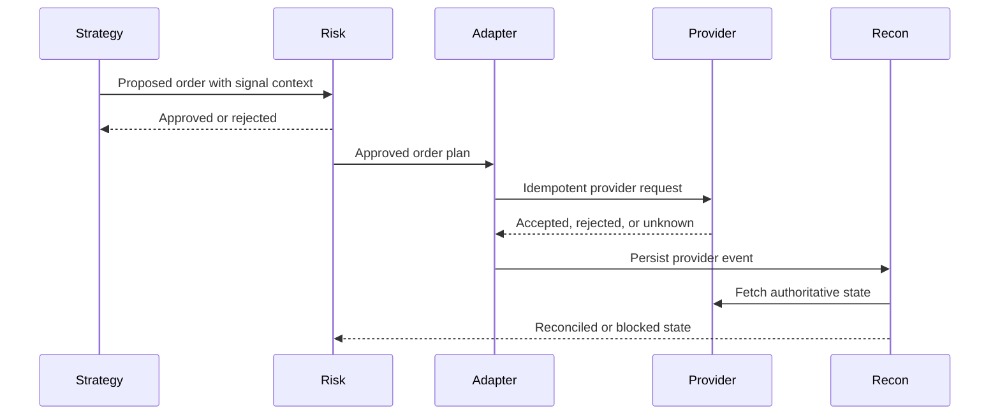

# Integration Architecture

Purpose: define how Forakilo integrates with external systems.
Scope: brokers, exchanges, market data, macro data, notifications, and observability.
Audience: engineers, security reviewers, legal counsel, and operators.
Assumptions: provider integrations are high-risk and must be verified per provider.
Dependencies: [API Provider Matrix](../research/API_AND_DATA_PROVIDER_MATRIX.md), [Exchange Credential Security](../security/EXCHANGE_CREDENTIAL_SECURITY.md).
Unresolved decisions: final approved providers and contract terms.

## Adapter Pattern

Each provider adapter MUST expose:

- Market-data subscription and backfill interfaces.
- Account snapshot and account-update interfaces where supported.
- Order submission, cancellation, and status interfaces where approved.
- Provider status and maintenance signals.
- Rate-limit, retry, idempotency, and backoff behavior.
- Provider-specific precision, minimum size, order type, and fee metadata.

## Provider Adapter Flow

## LLM Boundary

Any future LLM feature MUST be optional, isolated from order execution, disabled by default unless approved, and unable to submit, alter, or bypass risk controls for orders.
