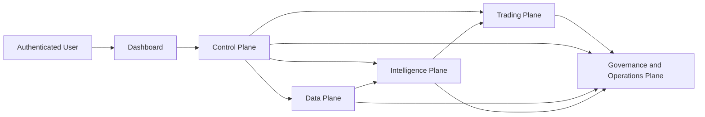

# System Architecture

Purpose: define the target architecture for Forakilo.
Scope: logical planes, major components, boundaries, and MVP architecture style.
Audience: engineers, product owners, security reviewers, risk reviewers, and operators.
Assumptions: Forakilo begins as a modular monolith; microservices require future evidence.
Dependencies: [ADR-0001](decisions/ADR-0001-modular-monolith-first.md), [Trust Boundaries](TRUST_BOUNDARIES.md), [Data Flow](DATA_FLOW.md).
Unresolved decisions: cloud provider, deployment topology, and service extraction boundaries.

## Architecture Style

Forakilo SHOULD begin as a modular monolith with strict internal modules and audit boundaries. The modules are grouped into five logical planes.

## Planes

- Control Plane: registration, login, sessions, MFA/passkeys, profile, permissions, admin, provider connection management, risk-policy configuration, dashboard APIs, notifications, and audit access.
- Data Plane: provider connectors, raw immutable ingestion, normalization, mapping, validation, gap detection, ordering, replay, provenance, retention, and point-in-time snapshots.
- Intelligence Plane: features, datasets, training, experiment tracking, model registry, regime detection, prediction, calibration, explainability, drift monitoring, retraining, candidate evaluation, and shadow deployment.
- Trading Plane: strategy policies, signals, portfolio state, position sizing, pre-trade checks, order planning, provider adapters, idempotency, order state, fills, reconciliation, kill switches, and emergency policies.
- Governance and Operations Plane: audit, logs, metrics, traces, alerts, security monitoring, incident response, release control, backup, recovery, compliance evidence, and runbooks.

## Safety Invariants

- No protected service is accessible before authentication.
- No model can bypass deterministic risk controls.
- No automated retraining job can promote directly into live execution in MVP or initial live releases.
- No live trading occurs until gates pass.
- No withdrawal permission is requested from provider credentials.
