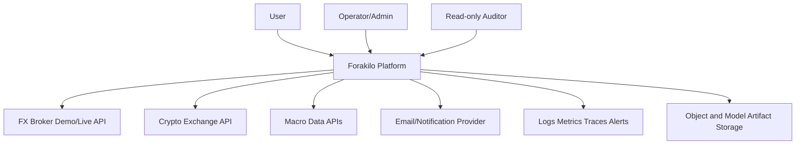

# System Context

Purpose: show Forakilo's external actors and systems.
Scope: users, providers, data sources, email/notification services, and operations tooling.
Audience: engineers, security reviewers, legal counsel, and operators.
Assumptions: external services are not yet contracted or implemented.
Dependencies: [Integration Architecture](INTEGRATION_ARCHITECTURE.md), [API Provider Matrix](../research/API_AND_DATA_PROVIDER_MATRIX.md).
Unresolved decisions: final providers, email vendor, and hosting environment.

## External Boundaries

- Users authenticate through Forakilo, not directly into internal services.
- Providers remain third-party systems with their own terms, status, and failure modes.
- Forakilo does not hold user funds in the MVP.
- General-purpose hosted LLM APIs are not part of the real-time market, risk, or execution path.
