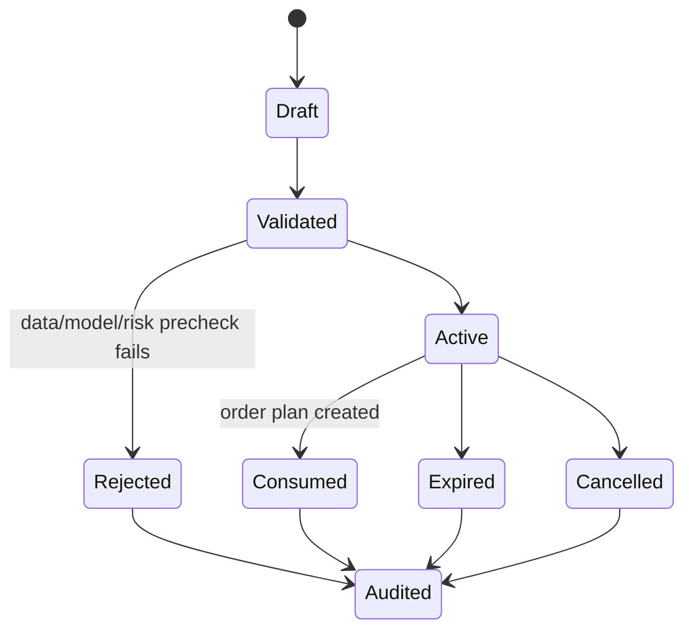

# Signal Lifecycle

Purpose: define how Forakilo creates, validates, expires, and audits signals.
Scope: rules-based, model-assisted, shadow, paper, and future live signals.
Audience: trading engineers, ML engineers, risk reviewers, and QA.
Assumptions: a signal is not an order; risk controls decide whether an order plan may proceed.
Dependencies: [Model Strategy](../ml/MODEL_STRATEGY.md), [Risk Management Policy](RISK_MANAGEMENT_POLICY.md).
Unresolved decisions: exact confidence thresholds by strategy.

## States

## Required Fields

Signal ID, user/account scope, strategy version, model version if applicable, dataset/feature references, action, confidence, calibration state, expiry time, input freshness, regime, proposed instrument, and audit correlation ID.

## Signal Rules

- Duplicate active signals for the same strategy/instrument/direction/time window MUST be deduplicated or explicitly versioned.
- Signals MUST expire on stale data, provider outage, risk-policy change, model suspension, or calibration breach.
- `BUY`, `SELL`, and `HOLD` semantics MUST be explicit per market and instrument.
